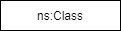

## 2. Specification

### 2.1 Basic Elements

<table style="width:100%">
  <tr>
    <th style="width:30%" style="text-align:center">Diagram BLOCK</th>
    <th style="width:20%">OWL Element</th>
    <th style="width:50%">Description</th>
  </tr>

  <tr>
    <td class="first-column"></td>
    <td><code>owl:Class</code></td>
    <td>Block to represent classes within the ontology conceptualization. 
    The content of the block should be accompanied with the prefix and the name of the concept on order to fully identify it.</td>
  </tr>

  <tr>
    <td class="first-column"></td>
    <td><code>owl:Class</code></td>
    <td>Block to represent an unnamed or anonynoums class. Used to declare a restriction over a named class.</td>
  </tr>

  <tr>
    <td class="first-column"></td>
    <td><code>owl:Individual</code></td>
    <td>Block to represent individuals</td>
  </tr>

  <tr>
    <td class="first-column"></td>
    <td><code>owl:ObjectProperty</code></td>
    <td>Standard way to represent object properties. Variations can apply to the type of line or the connections style. See sections 2.2 and 2.3 for further details.</td>
  </tr>

  <tr>
    <td class="first-column"></td>
    <td><code>owl:subClassOf</code></td>
    <td>Special arrows to indicate sub-class relationship.</td>
  </tr>

  <tr>
    <td class="first-column"></td>
    <td><code>rdf:type</code></td>
    <td>Special arrows to indicate <code>rdf:type</code> relationship.</td>
  </tr>

  <tr>
    <td class="first-column"></td>
    <td><code>owl:DatatypeProperty</code></td>
    <td>Standard way to represent datatype properties attached to a specific <code>owl:Class</code> element. Variations can apply to the type of outer line or the content of the block. See sections 2.4 or 2.5 for further details.</td>
  </tr>

  <tr>
    <td class="first-column"></td>
    <td><code>owl:ObjectProperty</code> 
        <code>owl:DatatypeProperty</code>
    </td>
    <td>Alternative option to represent object properties and datatype properties. Mainly used to represent sub-property or equivalence relationships between properties. For more details see section X.X</td>
  </tr>

  <tr>
    <td class="first-column"></td>
    <td><code>owl:intersectionOf</code> 
        <code>owl:unionOf</code> 
        <code>owl:equivalentClass</code> 
        <code>owl:disjointWith</code> 
    </td>
    <td>Block to indicate intersection or union of two or more <code>owl:Class</code> elements. Additionally, it can be used to determine equivalence and disjoint relationships between concepts.</td>
  </tr>

  <tr>
    <td class="first-column"></td>
    <td><code>@prefix base: &lt;http://namespace.com#&gt;</code></td>
    <td>Block to indicate all the namespaces used in the ontology. The first namespace is the URI used for the current ontology. It is obligatory to include all the namespaces being used in order to use the ontology converter service.</td>
  </tr>

  <tr>
    <td class="first-column"></td>
    <td><code>owl:AnnotationProperty</code></td>
    <td>Block to indicate the annotations and values describing the ontology. The annotations in use should include the prefix and the annotation name, as indicated in the figure. If custom annotations are utilized, the namespace block should the namespace for those annotation properties.</td>
  </tr>
</table>

### 2.2 Universal Restrictions for Object Properties

<table style="width:100%">
  <tr>
    <th style="width:25%">Diagram BLOCK</th>
    <th style="width:45%">OWL Element</th>
    <th style="width:30%">Description</th>
  </tr>

  <tr>
    <td class="first-column"></td>
    <td><code>ns:Class1 rdf:type owl:Class ; </code>
        &emsp;&emsp;<code>rdfs:subClassOf [ rdf:type owl:Restriction ; </code>
				&emsp;&emsp;<code>owl:onProperty ns:objectProperty ; </code>
				&emsp;&emsp;<code>owl:allValuesFrom ns:Class2 ] .</code></td>
    <td>Form 1 of an universal restriction between 2 concepts. <code>Class1</code> is subclass of an anonymus concept which has an object property <code>objectProperty</code>, and all the individuals for this property shall come from <code>Class2</code></td>
  </tr>

  <tr>
    <td class="first-column"></td>
    <td><code>ns:Class1 rdf:type owl:Class ; </code>
        &emsp;&emsp;<code>rdfs:subClassOf [ rdf:type owl:Restriction ; </code>
				&emsp;&emsp;<code>owl:onProperty ns:objectProperty ; </code>
				&emsp;&emsp;<code>owl:allValuesFrom ns:Class2 ] .</code></td>
    <td>Form 2 of an universal restriction between 2 concepts.</td>
  </tr>

  <tr>
    <td class="first-column"></td>
    <td><code>ns:Class1 rdf:type owl:Class ; </code>
        &emsp;&emsp;<code>rdfs:subClassOf [ rdf:type owl:Restriction ; </code>
				&emsp;&emsp;<code>owl:onProperty ns:objectProperty ; </code>
				&emsp;&emsp;<code>owl:allValuesFrom ns:Class2 ] .</code></td>
    <td>Form 3 of an universal restriction between 2 concepts.</td>
  </tr>
</table>

### 2.3 Existential Restrictions for Object Properties

<table style="width:100%">
  <tr>
    <th style="width:25%">Diagram BLOCK</th>
    <th style="width:45%">OWL Element</th>
    <th style="width:30%">Description</th>
  </tr>

  <tr>
    <td class="first-column"></td>
    <td><code>ns:Class1 rdf:type owl:Class ; </code>
        &emsp;&emsp;<code>rdfs:subClassOf [ rdf:type owl:Restriction ; </code>
				&emsp;&emsp;<code>owl:onProperty ns:objectProperty ; </code>
				&emsp;&emsp;<code>owl:someValuesFrom ns:Class2 ] .</code></td>
    <td>Form 1 of an existential restriction between 2 concepts. <code>Class1</code> is subclass of an anonymus concept which has an object property <code>objectProperty</code>, and some the individuals for this property shall come from <code>Class2</code></td>
  </tr>

  <tr>
    <td class="first-column"></td>
    <td><code>ns:Class1 rdf:type owl:Class ; </code>
        &emsp;&emsp;<code>rdfs:subClassOf [ rdf:type owl:Restriction ; </code>
				&emsp;&emsp;<code>owl:onProperty ns:objectProperty ; </code>
				&emsp;&emsp;<code>owl:someValuesFrom ns:Class2 ] .</code></td>
    <td>Form 2 of an existential restriction between 2 concepts.</td>
  </tr>

  <tr>
    <td class="first-column"></td>
    <td><code>ns:Class1 rdf:type owl:Class ; </code>
        &emsp;&emsp;<code>rdfs:subClassOf [ rdf:type owl:Restriction ; </code>
				&emsp;&emsp;<code>owl:onProperty ns:objectProperty ; </code>
				&emsp;&emsp;<code>owl:someValuesFrom ns:Class2 ] .</code></td>
    <td>Form 3 of an existential restriction between 2 concepts.</td>
  </tr>
</table>

### 2.4 Cardinality Restrictions for Object Properties

<table style="width:100%">
  <tr>
    <th style="width:25%">Diagram BLOCK</th>
    <th style="width:45%">OWL Element</th>
    <th style="width:30%">Description</th>
  </tr>

  <tr>
    <td class="first-column"></td>
    <td>
      <code>ns:Class1 rdf:type owl:Class ; </code>
        &emsp;&emsp;<code>rdfs:subClassOf [ rdf:type owl:Restriction ; </code>
				&emsp;&emsp;<code>owl:onProperty ns:objectProperty ; </code>
				&emsp;&emsp;<code>owl:minQualifiedCardinality "N1"^^xsd:nonNegativeInteger ; </code>
        &emsp;&emsp;<code>owl:onClass ns:Class2 ] , </code>
        &emsp;&emsp;<code>[ rdf:type owl:Restriction ; </code>
				&emsp;&emsp;<code>owl:onProperty ns:objectProperty ; </code>
				&emsp;&emsp;<code>owl:maxQualifiedCardinality "N2"^^xsd:nonNegativeInteger ; </code>
        &emsp;&emsp;<code>owl:onClass ns:Class2 ] .</code> 
    </td>
    <td>Cardinality restriction of a concept on an object property. <code>Class1</code> is subclass of an anonymus concept which has an object property <code>objectProperty</code>, and shall have at least N1 and at most N2 individuals from class <code>Class2</code>. If the N2 element is equal to the letter N, it means <code>owl:maxQualifiedCardinality</code> does not exist.</td>
  </tr>
  </table>

### 2.5 Universal Restrictions for Datatype Properties

<table style="width:100%">
  <tr>
    <th style="width:25%">Diagram BLOCK</th>
    <th style="width:45%">OWL Element</th>
    <th style="width:30%">Description</th>
  </tr>
  <tr>
    <td class="first-column"></td>
    <td><code>ns:Class1 rdf:type owl:Class ; </code>
        &emsp;&emsp;<code>rdfs:subClassOf [ rdf:type owl:Restriction ; </code>
				&emsp;&emsp;<code>owl:onProperty ns:datatypeProperty1 ; </code>
				&emsp;&emsp;<code>owl:allValuesFrom datatype ] .</code>
    </td>
    <td>Form 1 of an universal restriction between a concept and a datatype. <code>Class1</code> is subclass of an anonymus concept which has a datatype property <code>datatypeProperty1</code>, and all the values must be of type <code>datatype</code>.</td>
  </tr>
  <tr>
    <td class="first-column"></td>
    <td><code>ns:Class1 rdf:type owl:Class ; </code>
        &emsp;&emsp;<code>rdfs:subClassOf [ rdf:type owl:Restriction ; </code>
				&emsp;&emsp;<code>owl:onProperty ns:datatypeProperty1 ; </code>
				&emsp;&emsp;<code>owl:allValuesFrom datatype ] .</code>
    </td>
    <td>Form 2 of an universal restriction between a concept and a datatype.</td>
  </tr>
</table>

### 2.6 Existential Restrictions for Datatype Properties

<table style="width:100%">
  <tr>
    <th style="width:25%">Diagram BLOCK</th>
    <th style="width:45%">OWL Element</th>
    <th style="width:30%">Description</th>
  </tr>
  <tr>
    <td class="first-column"></td>
    <td><code>ns:Class1 rdf:type owl:Class ; </code>
        &emsp;&emsp;<code>rdfs:subClassOf [ rdf:type owl:Restriction ; </code>
				&emsp;&emsp;<code>owl:onProperty ns:datatypeProperty1 ; </code>
				&emsp;&emsp;<code>owl:someValuesFrom datatype ] .</code>
    </td>
    <td>Form 1 of an existential restriction between a concept and a datatype. <code>Class1</code> is subclass of an anonymus concept which has a datatype property <code>datatypeProperty1</code>, and some values must be of type <code>datatype</code>.</td>
  </tr>
  <tr>
    <td class="first-column"></td>
    <td><code>ns:Class1 rdf:type owl:Class ; </code>
        &emsp;&emsp;<code>rdfs:subClassOf [ rdf:type owl:Restriction ; </code>
				&emsp;&emsp;<code>owl:onProperty ns:datatypeProperty1 ; </code>
				&emsp;&emsp;<code>owl:someValuesFrom datatype ] .</code>
    </td>
    <td>Form 2 of an existential restriction between a concept and a datatype.</td>
  </tr>
</table>

### 2.7 Cardinality Restrictions for Datatype Properties

<table style="width:100%">
  <tr>
    <th style="width:25%">Diagram BLOCK</th>
    <th style="width:45%">OWL Element</th>
    <th style="width:30%">Description</th>
  </tr>

  <tr>
    <td class="first-column"></td>
    <td>
      <code>ns:Class1 rdf:type owl:Class ; </code>
        &emsp;&emsp;<code>rdfs:subClassOf [ rdf:type owl:Restriction ; </code>
				&emsp;&emsp;<code>owl:onProperty ns:datatypeProperty1 ; </code>
				&emsp;&emsp;<code>owl:minCardinality "N1"^^xsd:nonNegativeInteger ] , </code>
        &emsp;&emsp;<code>[ rdf:type owl:Restriction ; </code>
				&emsp;&emsp;<code>owl:onProperty ns:datatypeProperty1 ; </code>
				&emsp;&emsp;<code>owl:maxCardinality "N2"^^xsd:nonNegativeInteger ] .</code> 
    </td>
    <td>Cardinality restriction of a concept on a datatype property. <code>Class1</code> is subclass of an anonymus concept which has an datatype property <code>datatypeProperty1</code>, and shall have at least N1 and at most N2 values. If the N2 element is equal to the letter N, it means <code>owl:maxCardinality</code> does not exist.</td>
  </tr>
  </table>

### 2.8 Domain and Range for Object Properties

<table style="width:100%">

  <tr>
    <th style="width:25%">Diagram BLOCK</th>
    <th style="width:45%">OWL Element</th>
    <th style="width:30%">Description</th>
  </tr>

  <tr>
    <td class="first-column"></td>
    <td><code>ns:objectProperty rdf:type owl:ObjectProperty .</code></td>
    <td>Object property <code>ns:objectProperty</code> without domain and range form 1.</td>
  </tr>

  <tr>
    <td class="first-column"></td>
    <td><code>ns:objectProperty rdf:type owl:ObjectProperty .</code></td>
    <td>Object property <code>ns:objectProperty</code> without domain and range form 2.</td>
  </tr>

  <tr>
    <td class="first-column"></td>
    <td><code>ns:objectProperty rdf:type owl:ObjectProperty ; </code>
        &emsp;&emsp;<code>rdfs:domain ns:Class1 ; </code>
        &emsp;&emsp;<code>rdfs:range ns:Class2 . </code></td>
    <td>Object property <code>ns:objectProperty</code> with domain and range form 1.</td>
  </tr>

  <tr>
    <td class="first-column"></td>
    <td><code>ns:objectProperty rdf:type owl:ObjectProperty ; </code>
        &emsp;&emsp;<code>rdfs:domain ns:Class1 ; </code>
        &emsp;&emsp;<code>rdfs:range ns:Class2 . </code></td>
    <td>Object property <code>ns:objectProperty</code> with domain and range form 2.</td>

  </tr>

  <tr>
    <td class="first-column"></td>
    <td><code>ns:objectProperty rdf:type owl:ObjectProperty ; </code>
        &emsp;&emsp;<code>rdfs:domain ns:Class1 .</code></td>
    <td>Object property <code>ns:objectProperty</code> with domain but without range.</td>
  </tr>

  <tr>
    <td class="first-column"></td>
    <td><code>ns:objectProperty rdf:type owl:ObjectProperty ; </code>
        &emsp;&emsp;<code>rdfs:range ns:Class2 .</code></td>
    <td>Object property <code>ns:objectProperty</code> with range but without domain.</td>
  </tr>
  </table>

### 2.9 Domain and Range for Datatype Properties

<table style="width:100%">

  <tr>
    <th style="width:25%">Diagram BLOCK</th>
    <th style="width:45%">OWL Element</th>
    <th style="width:30%">Description</th>
  </tr>

  <tr>
    <td class="first-column"></td>
    <td><code>ns:datatypeProperty1 rdf:type owl:DatatypeProperty .</code></td>
    <td>Datatype property <code>ns:datatypeProperty1</code> without domain and range.</td>
  </tr>

  <tr>
    <td class="first-column"></td>
    <td><code>ns:datatypeProperty1 rdf:type owl:DatatypeProperty ;</code>
        &emsp;&emsp;<code>rdfs:domain ns:Class1 ; </code>
        &emsp;&emsp;<code>rdfs:range datatype . </code></td>
    <td>Datatype property <code>ns:datatypeProperty1</code> with domain and range.</td>
  </tr>

  <tr>
    <td class="first-column"></td>
    <td><code>ns:datatypeProperty1 rdf:type owl:DatatypeProperty ;</code>
        &emsp;&emsp;<code>rdfs:domain ns:Class1 . </code></td>
    <td>Datatype property <code>ns:datatypeProperty1</code> with domain and without range.</td>
  </tr>

  <tr>
    <td class="first-column"></td>
    <td><code>ns:datatypeProperty1 rdf:type owl:DatatypeProperty ;</code>
        &emsp;&emsp;<code>rdfs:range datatype . </code></td>
    <td>Datatype property <code>ns:datatypeProperty1</code> without domain and with range.</td>
  </tr>
</table>

### 2.10 Intersection and Union of Concepts

<table style="width:100%">

  <tr>
    <th style="width:25%">Diagram BLOCK</th>
    <th style="width:45%">OWL Element</th>
    <th style="width:30%">Description</th>
  </tr>
  
  <tr>
    <td class="first-column"></td>
    <td><code>owl:intersectionOf (ns:Class1 ns:Class2)</code></td>
    <td>Intersection of two concepts. Form 1.</td>
  </tr>

  <tr>
    <td class="first-column"></td>
    <td><code>owl:intersectionOf (ns:Class1 ns:Class2)</code></td>
    <td>Intersection of two concepts. Form 2.</td>
  </tr>

  <tr>
    <td class="first-column"></td>
    <td><code>owl:unionOf (ns:Class1 ns:Class2)</code></td>
    <td>Union of two concepts. Form 1.</td>
  </tr>

  <tr>
    <td class="first-column"></td>
    <td><code>owl:unionOf (ns:Class1 ns:Class2)</code></td>
    <td>Union of two concepts. Form 2.</td>
  </tr>
</table>

### 2.11 Equivalence and Disjointness of Concepts

<table style="width:100%">

  <tr>
    <th style="width:25%">Diagram BLOCK</th>
    <th style="width:45%">OWL Element</th>
    <th style="width:30%">Description</th>
  </tr>
  
  <tr>
    <td class="first-column"></td>
    <td><code>ns:Class1 owl:equivalentClass ns:Class2</code></td>
    <td>Equivalence between two concepts. Form 1.</td>
  </tr>

  <tr>
    <td class="first-column"></td>
    <td><code>ns:Class1 owl:equivalentClass ns:Class2</code></td>
    <td>Equivalence between two concepts. Form 2.</td>
  </tr>

  <tr>
    <td class="first-column"></td>
    <td><code>ns:Class1 owl:disjointWith ns:Class2</code></td>
    <td>Disjointness between two concepts. Form 1.</td>
  </tr>

  <tr>
    <td class="first-column"></td>
    <td><code>ns:Class1 owl:disjointWith ns:Class2</code></td>
    <td>Disjointness between two concepts. Form 2.</td>
  </tr>
</table>

### 2.12 Relations between Properties

The following section applies to both type of properties: <code>owl:ObjectProperties</code> and <code>owl:DatatypeProperties</code>. For demonstration purposes we will only use object properties in the examples.
<table style="width:100%">
  <tr>
    <th style="width:25%">Diagram BLOCK</th>
    <th style="width:45%">OWL Element</th>
    <th style="width:30%">Description</th>
  </tr>

  <tr>
    <td class="first-column"></td>
    <td><code>ns:objectProperty1 rdfs:subPropertyOf ns:objectProperty2</code></td>
    <td>Sub-property relationship between two object properties. Form 1.</td>
  </tr>
  <tr>
    <td class="first-column"></td>
    <td><code>ns:objectProperty1 rdfs:subPropertyOf ns:objectProperty2</code></td>
    <td>Sub-property relationship between two object properties. Form 2.</td>
  </tr>
  <tr>
    <td class="first-column"></td>
    <td><code>ns:objectProperty1 owl:equivalentProperty ns:objectProperty2</code></td>
    <td>Equivalence relationship between two object properties. Form 1.</td>
  </tr>
  <tr>
    <td class="first-column"></td>
    <td><code>ns:objectProperty1 owl:equivalentProperty ns:objectProperty2</code></td>
    <td>Equivalence relationship between two object properties. Form 2.</td>
  </tr>
  <tr>
    <td class="first-column"></td>
    <td><code>ns:objectProperty1 owl:inverseOf ns:objectProperty2</code></td>
    <td>Inverse relationship between two object properties. Form 1.</td>
  </tr>
  <tr>
    <td class="first-column"></td>
    <td><code>ns:objectProperty1 owl:inverseOf ns:objectProperty2</code></td>
    <td>Inverse relationship between two object properties. Form 2.</td>
  </tr>
</table>

### 2.13 Constructs for Indiviuals and RDF data

<table style="width:100%">
  <tr>
    <th style="width:25%">Diagram BLOCK</th>
    <th style="width:45%">OWL Element</th>
    <th style="width:30%">Description</th>
  </tr>

  <tr>
    <td class="first-column"></td>
    <td><code>ns:Individual1 rdf:type ns:Class1 .</code></td>
    <td>Form 1 of Individual type definition.</td>
  </tr>

  <tr>
    <td class="first-column"></td>
    <td><code>ns:Individual1 rdf:type ns:Class1 .</code></td>
    <td>Form 2 of Individual type definition.</td>
  </tr>

  <tr>
    <td class="first-column"></td>
    <td><code>ns:Individual1 ns:objectProperty ns:Individual2 .</code></td>
    <td>Association between individuals in RDF graphs.</td>
  </tr>

  <tr>
    <td class="first-column"></td>
    <td><code>ns:Individual1 ns:datatypeProperty "datatype_value"^^datatype .</code></td>
    <td>Association between individuals and datatype values.</td>
  </tr>
</table>